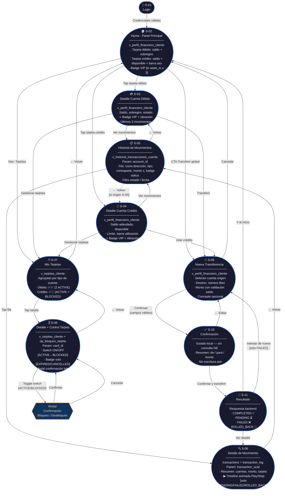

```mermaid
flowchart TD
    S01(["🔐 S-01\nLogin"])
    S02(["🏠 S-02\nHome · Panel Principal\n────────────────\nv_perfil_financiero_cliente\n· Tarjeta débito: saldo + sobregiro\n· Tarjeta crédito: saldo + disponible + barra uso\n· Badge VIP [si week_tx ≥ 3]"])

    S03(["💳 S-03\nDetalle Cuenta Débito\n────────────────\nv_perfil_financiero_cliente\n· Saldo, sobregiro, estado\n· ⭐ Badge VIP + vibración\n· Últimos 3 movimientos"])

    S04(["💎 S-04\nDetalle Cuenta Crédito\n────────────────\nv_perfil_financiero_cliente\n· Saldo adeudado, disponible\n· Límite, barra utilización\n· ⭐ Badge VIP + vibración"])

    S05(["📋 S-05\nHistorial de Movimientos\n────────────────\nv_historial_transacciones_cuenta\nParam: account_id\n· Fila: ícono dirección, tipo,\n  contraparte, monto ±, badge status\n· Filtro estado / fecha"])

    S06(["🔍 S-06\nDetalle de Movimiento\n────────────────\ntransactions + transaction_log\nParam: transaction_uuid\n· Resumen: cuentas, monto, tarjeta\n· ▶ Timeline animada Play/Stop\n  [solo PENDING/FAILED/ROLLED_BACK]"])

    S07(["🃏 S-07\nMis Tarjetas\n────────────────\nv_tarjetas_cliente\nAgrupado por tipo de cuenta:\n· Débito: ✅✅ (2 ACTIVE)\n· Crédito: ✅🔴 (ACTIVE + BLOCKED)"])

    S08(["🎚 S-08\nDetalle + Control Tarjeta\n────────────────\nv_tarjetas_cliente + op_bloqueo_tarjeta\nParam: card_id\n· Switch ON/OFF [ACTIVE↔BLOCKED]\n· Badge solo [EXPIRED/CANCELLED]\n· Modal confirmación inline"])

    S09(["💸 S-09\nNueva Transferencia\n────────────────\nv_perfil_financiero_cliente\n· Selector cuenta origen\n· Destino: número libre\n· Monto con validación saldo\n· Concepto opcional"])

    S10(["✅ S-10\nConfirmación\n────────────────\nEstado local — sin consulta DB\n· Resumen: de / para / monto\n· Sin escritura aún"])

    S11(["📣 S-11\nResultado\n────────────────\nRespuesta backend\n· COMPLETED ✅\n· PENDING ⏳\n· FAILED ❌\n· ROLLED_BACK 🔄"])

    MODAL_BLOQUEO{{"Modal\nConfirmación\nBloqueo / Desbloqueo"}}

    %% Auth
    S01 -->|"Credenciales válidas"| S02

    %% Home → detalles
    S02 -->|"Tap tarjeta débito"| S03
    S02 -->|"Tap tarjeta crédito"| S04
    S02 -->|"CTA Transferir global"| S09
    S02 -->|"Nav: Tarjetas"| S07

    %% Detalle débito
    S03 -->|"Ver movimientos"| S05
    S03 -->|"Transferir"| S09
    S03 -->|"Gestionar tarjetas"| S07

    %% Detalle crédito
    S04 -->|"Ver movimientos"| S05
    S04 -->|"Usar crédito"| S09
    S04 -->|"Gestionar tarjetas"| S07

    %% Historial → detalle movimiento
    S05 -->|"Tap fila"| S06
    S05 -->|"← Volver"| S03
    S05 -.->|"← Volver\n[si origen S-04]"| S04

    %% Tarjetas
    S07 -->|"Tap tarjeta"| S08
    S07 -->|"← Volver"| S02

    %% Control tarjeta
    S08 -->|"Toggle switch\n[ACTIVE/BLOCKED]"| MODAL_BLOQUEO
    MODAL_BLOQUEO -->|"Confirmar"| S08
    MODAL_BLOQUEO -->|"Cancelar"| S08
    S08 -->|"← Volver"| S07

    %% Transferencia
    S09 -->|"Continuar\n[campos válidos]"| S10
    S09 -->|"Cancelar"| S02
    S10 -->|"Confirmar y transferir"| S11
    S10 -->|"← Editar"| S09
    S11 -->|"Ir al inicio"| S02
    S11 -->|"Ver detalle"| S06
    S11 -->|"Intentar de nuevo\n[solo FAILED]"| S09

    %% S-06 back
    S06 -->|"← Volver"| S05

    %% Styling
    classDef screen fill:#1a1a2e,stroke:#4f8ef7,stroke-width:2px,color:#e8eaf6,rx:8
    classDef action fill:#16213e,stroke:#f7a440,stroke-width:2px,color:#ffd180,rx:6
    classDef modal fill:#0f3460,stroke:#f7a440,stroke-width:2px,color:#ffd180,rx:12

    class S01,S02,S03,S04,S05,S06,S07,S08,S09,S10,S11 screen
    class MODAL_BLOQUEO modal
```